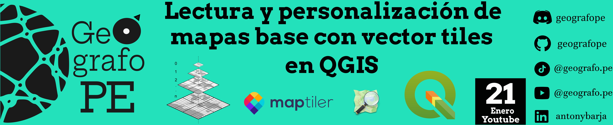

ls

Este repositorio 🗂️ contiene una serie de pasos 📑 de como obtener los vector tiles  que se encuentran disponibles en `MapTiler` y como puedes consumirlo a través del software de `QGIS`usando el plugin del mismo nombre. 

Para este video usaremos las siguientes herramientas:

- [QGIS](https://www.qgis.org/): Software de Sistema de Información Geográfica libre y de código abierto que permite manipular, editar, analizar y visualizar datos espaciales.

- [MapTiler](https://www.maptiler.com/): La plataforma de mapas Open Source creada por desarrolladores para desarrolladores.

## ⚫ Pasos a realizar 

1. Primer paso: Instalar el Plugin de `MapTiler` en `QGIS`.
2. Segundo paso: Activar token en `MapTiler` para usarlo en `QGIS`.
3. Tercer paso: Consumir los diferentes vector tiles de `MapTiler`.
4. Cuarto paso: Personalizar vector tiles de `MapTiler` en `QGIS`.

Todo el proceso desarrollado esta explicado al detalle en el siguiente video de YouTube 🎥.

¡Enteráte más y aprender conmigo! 🔍💡 Suscríbete, activa las notificaciones 🔔 y únete a la comunidad que ama el software libre de código abierto. 🌟🌍 👇
- https://www.youtube.com/@geografope

- https://www.tiktok.com/@geografope

- https://www.linkedin.com/in/antonybarja/

## ⚫ Referencias 
 - http://maptiler.com/qgis-plugin/
 - https://github.com/ambarja/MapTiler-QGIS
